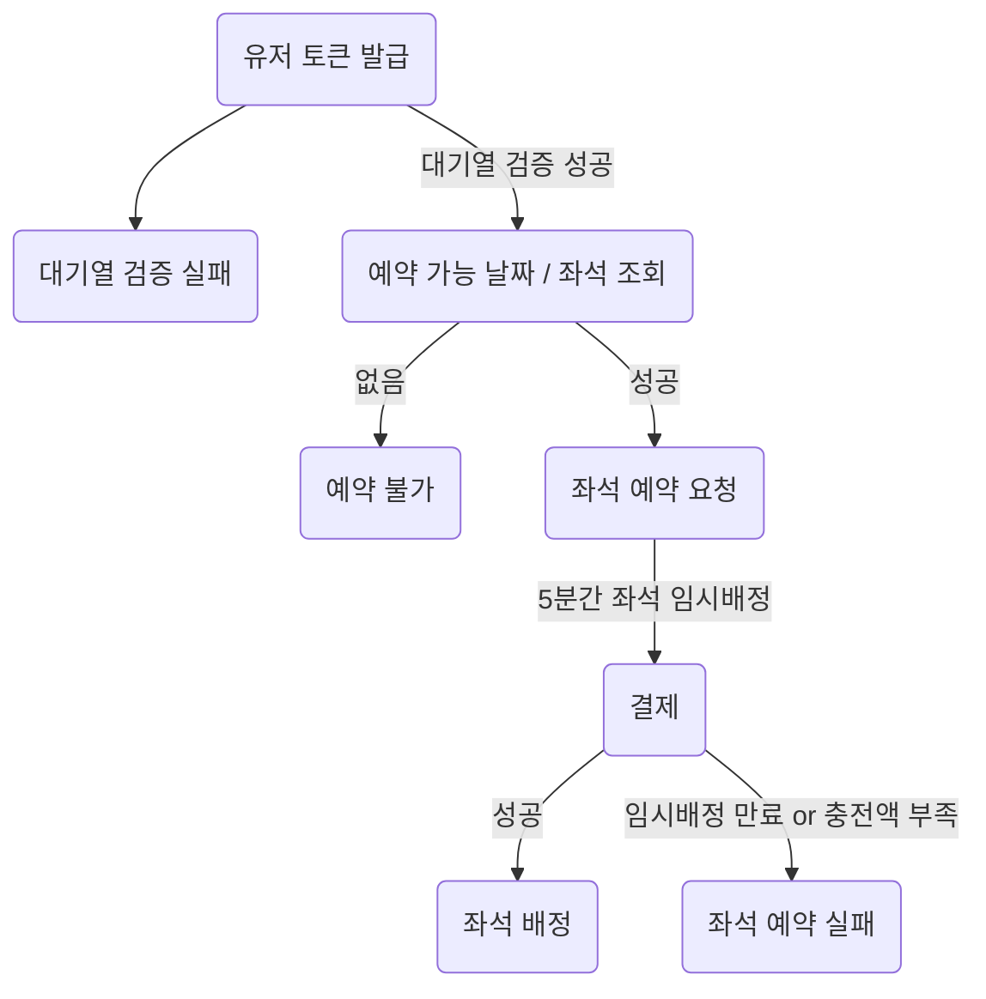
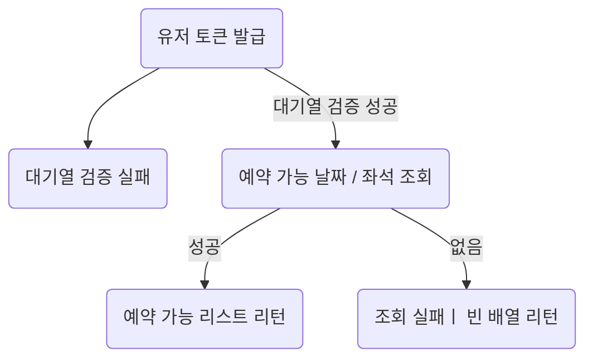
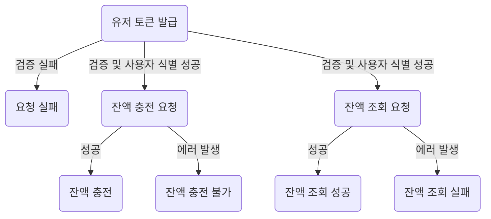

# concert-reservation

# MileStones
[View the Full Roadmap](https://github.com/users/jhshin29/projects/1/views/1)

# Flowchart
## 예약 flow

```mermaid
flowchart TD
%% Nodes
    A(유저 토큰 발급)
    A1(대기열 검증 실패)
    C(예약 가능 날짜 / 좌석 조회)
    C1(예약 불가)
    D(좌석 예약 요청)
    E(결제)
    E1(좌석 예약 실패)
    F(좌석 배정)

%% Edge connections between nodes
    A --> |대기열 검증 성공|C --> |성공|D --> |5분간 좌석 임시배정|E --> |성공|F
    A --> A1
    C --> |없음|C1
    E --> |임시배정 만료 or 충전액 부족|E1
```

## 예약 가능 날짜 / 좌석 조회 flow

```mermaid
flowchart TD
%% Nodes
    A(유저 토큰 발급)
    A1(대기열 검증 실패)
    C(예약 가능 날짜 / 좌석 조회)
    C1(조회 실패ㅣ 빈 배열 리턴)
    D(예약 가능 리스트 리턴)

%% Edge connections between nodes
    A --> |대기열 검증 성공|C --> |성공|D
    A --> A1
    C --> |없음|C1
```

## 잔액 충전 / 조회 flow

```mermaid
flowchart TD
%% Nodes
    A(유저 토큰 발급)
    A1(요청 실패)
    B(잔액 충전 요청)
    B1(잔액 조회 요청)
    C(잔액 충전)
    D(잔액 조회 성공)
    D1(잔액 조회 실패)
    E(잔액 충전 불가)


%% Edge connections between nodes
    A --> |검증 및 사용자 식별 성공|B --> |성공|C
    A --> |검증 실패|A1
    A --> |검증 및 사용자 식별 성공|B1 --> |성공|D
    B --> |에러 발생|E
    B1 --> |에러 발생|D1
```
