# 콘서트 예약 서비스 Docs

# MileStones
### 마일스톤 링크
[View the Full Roadmap](https://github.com/users/jhshin29/projects/1/views/1)
***
### 1주차 마일스톤

### 2-3주차 마일스톤

***
# Flowchart
## 예약 flow
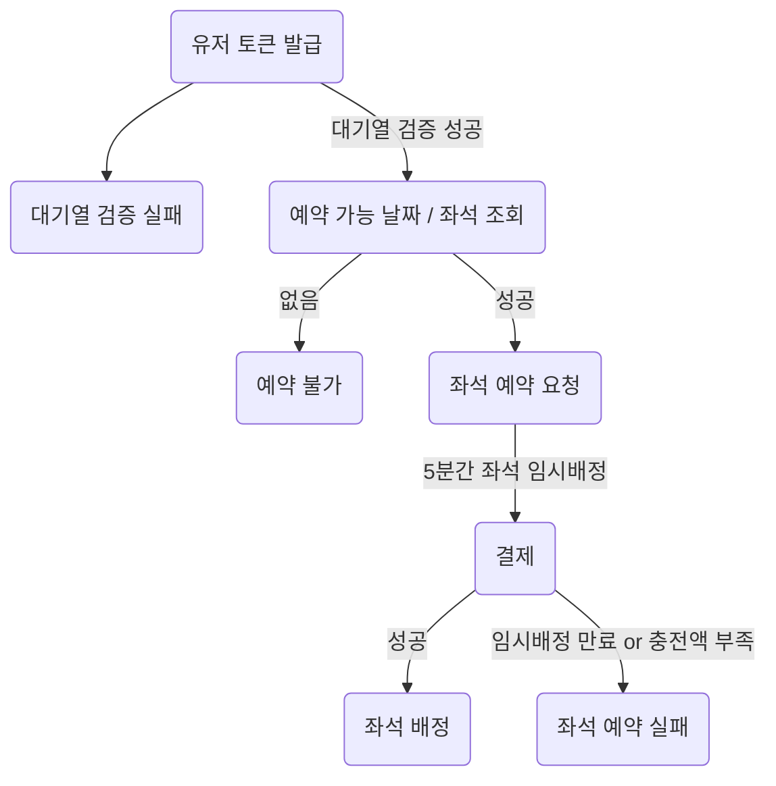

## 예약 가능 날짜 / 좌석 조회 flow
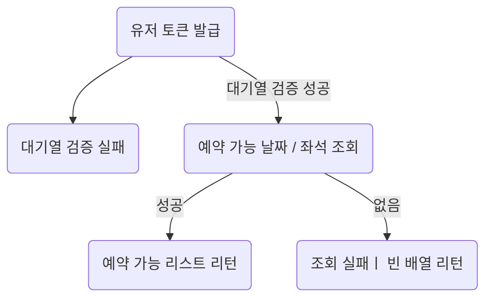

## 잔액 충전 / 조회 flow
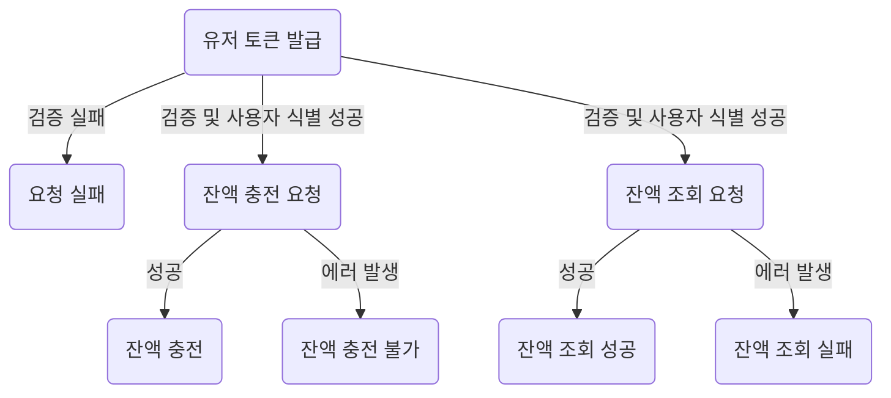

# Sequence Diagram

## 유저 대기열 토큰 발급 API

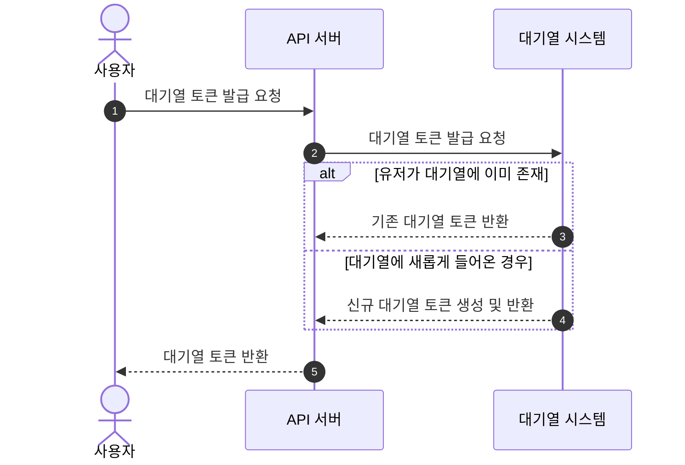

## 나의 대기번호 조회 API (토큰 검증) - Polling

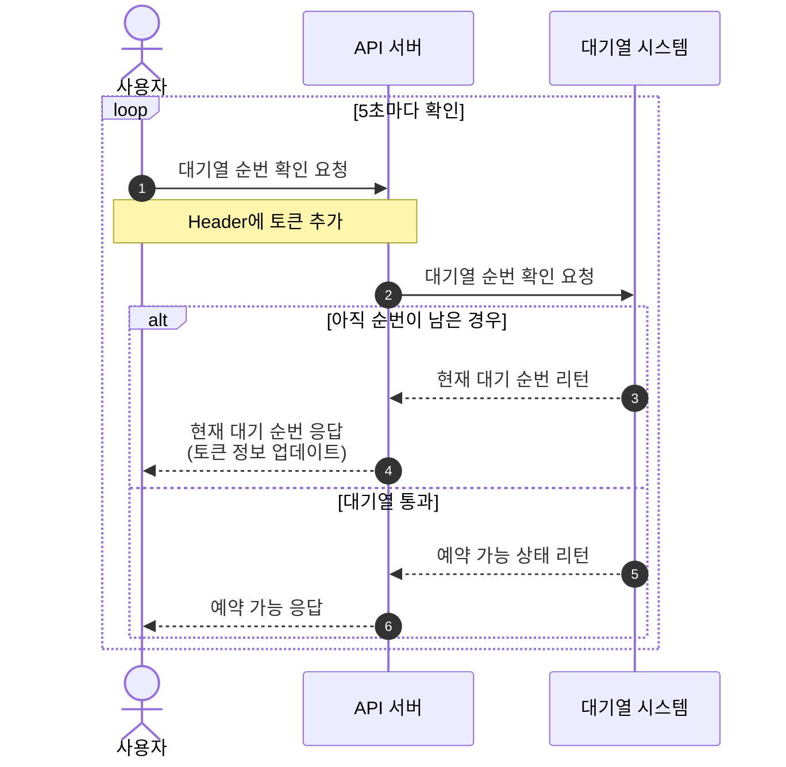

## 예약 가능 날짜 조회 API

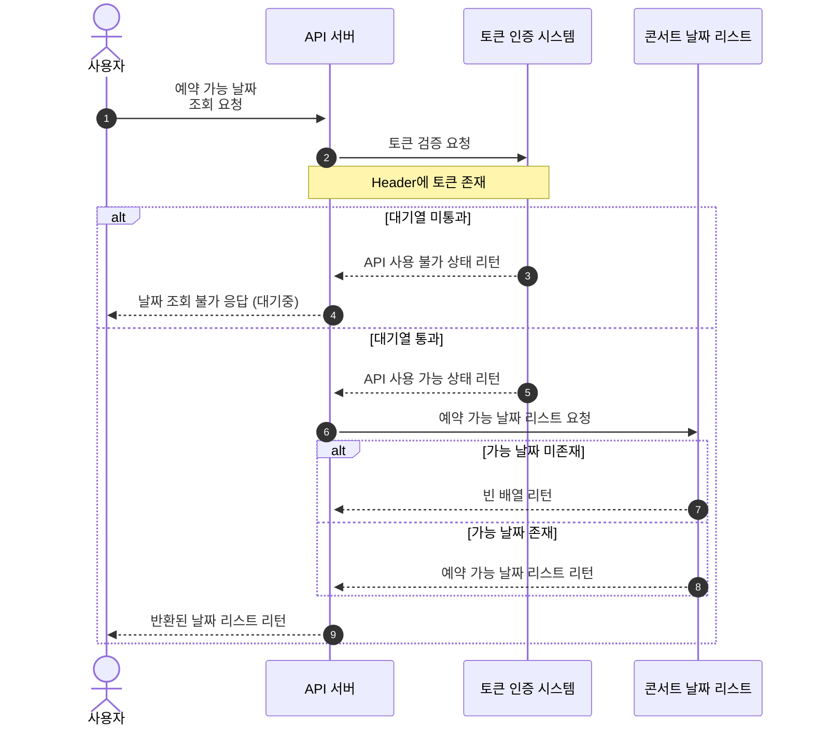

## 예약 가능 좌석 조회 API

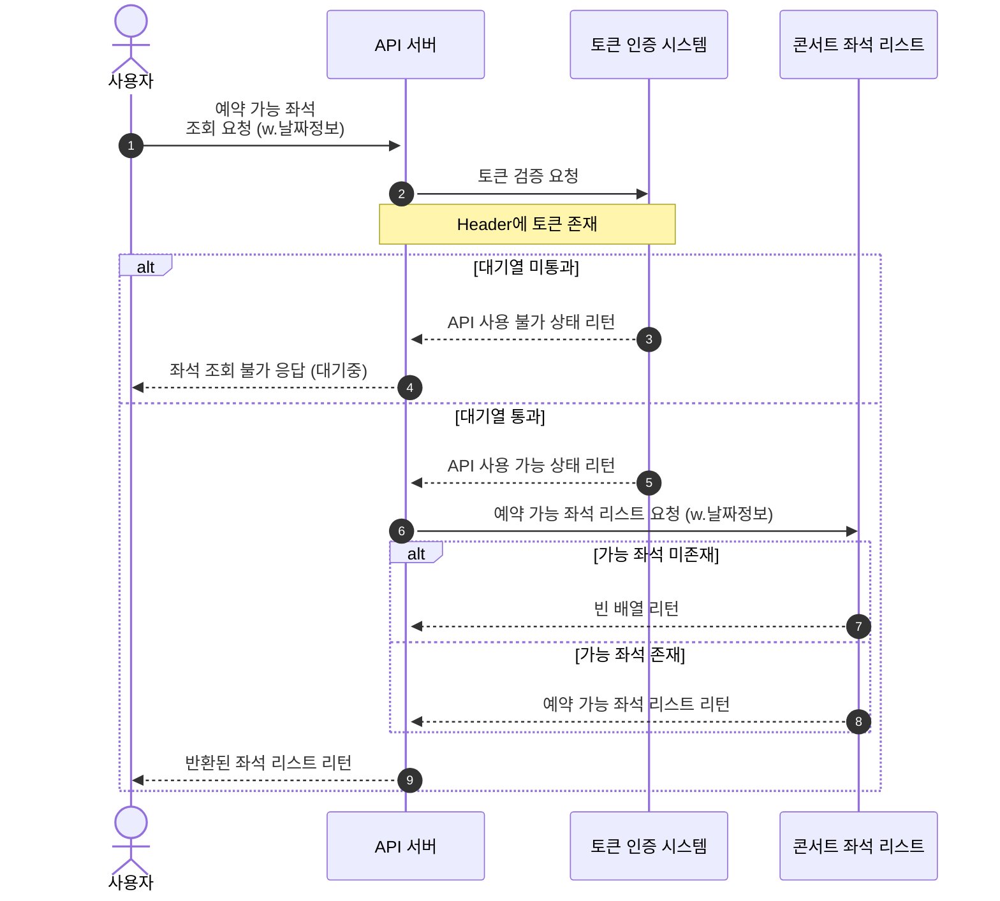

## 좌석 예약 요청 API

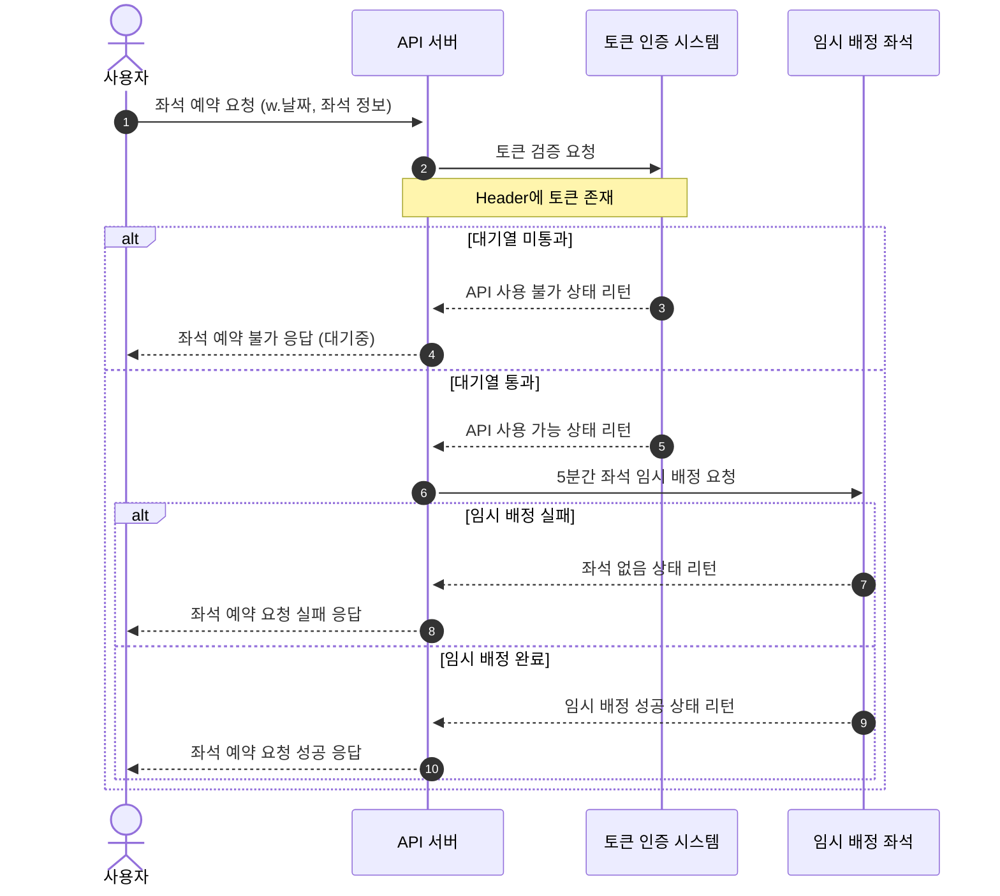
## 잔액 조회 API

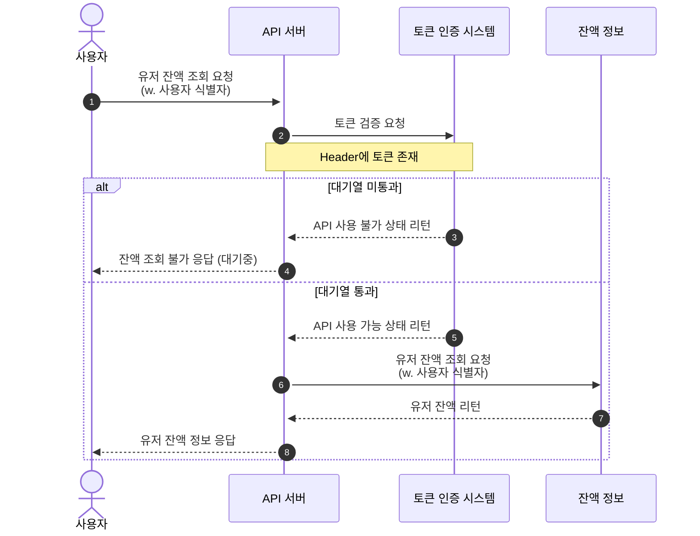

## 잔액 충전 API

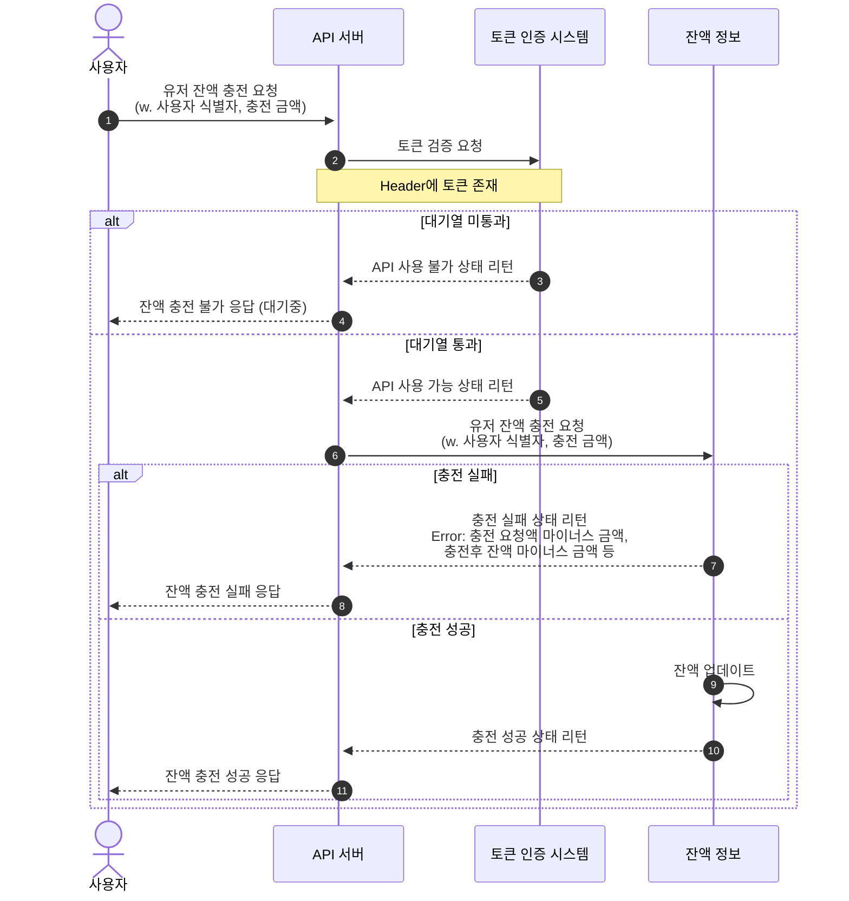
## 결제 API

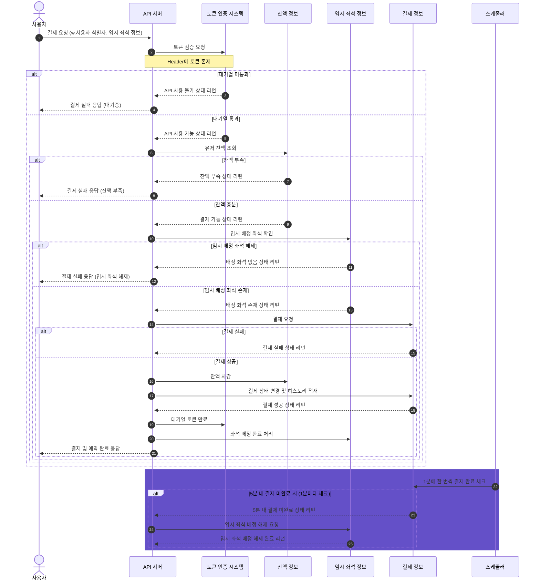